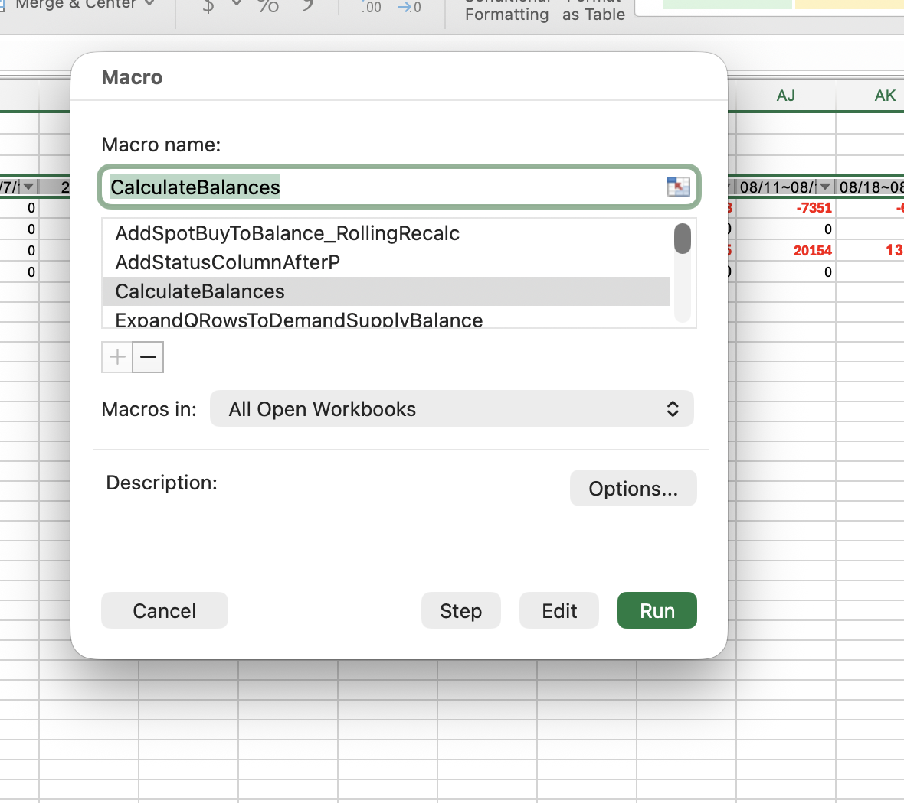
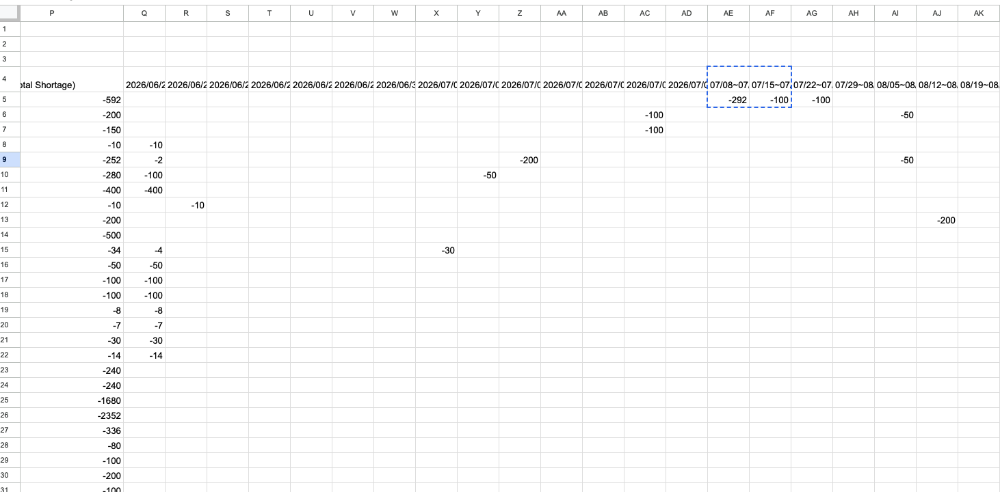
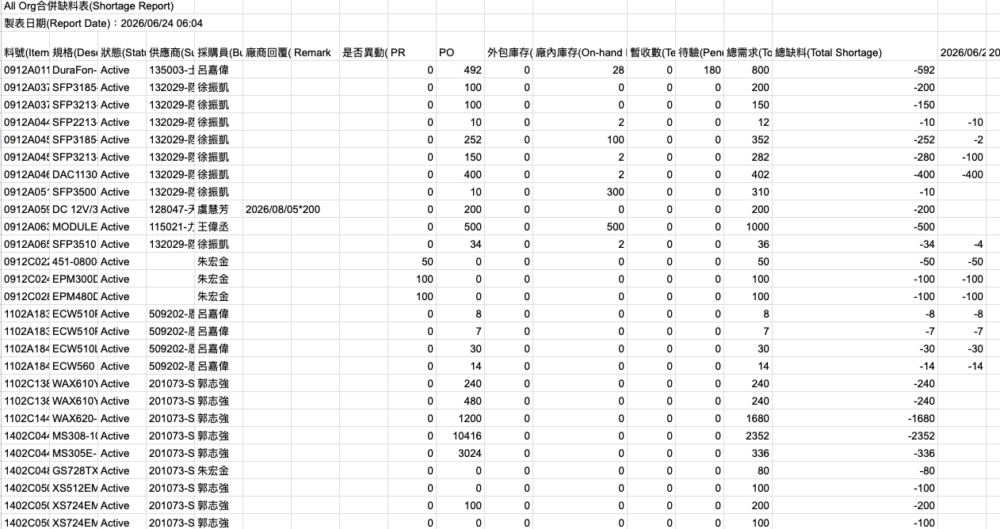

 # Rolling Inventory Pipeline: Optimizing Supply Chain Shortage Reports with GAS and VBA Memory Arrays

## Concepts:
- In-Place Backward Loop / Memory Array Method 
- Data Wrangling (or Date String Parsing), HashMapping ,ETL pipeline for multiple tables
- Minimize Time Complexity Approach (For 3 rows as a set reptitivie pattern )
- Consolidated Shortage Table
## Example Modules
- ParseYMD()
- ParseMD()
- DateBelongsToHeader()
- GetQtyFromColumnF()
- ToNumbers()
- FillSpotBuyBlanksWithZero()
- CalculateBalances()


### 1. Understand / Business Goal  : 
- This project starts from a real supply-chain shortage problem:

The company has a shortage report table with  demand, supply, balance, planned purchase, spot-buy, and vendor response information **spread across different tables**. Manual update is slow because each part number may have multiple vendors, multiple purchase dates, and multiple time buckets.

- The business goal is:

:::success
Convert a messy shortage report into a structured, automated planning table that shows demand, supply, balance, spot-buy, and updated shortage status by date bucket.
:::

- Core business logic:
 **Demand + Supply + SpotBuy = Updated Balance**

- For rolling inventory:
```

Current Balance =
Previous Balance
+ Current Demand
+ Current Supply
+ Current SpotBuy

```
### 2. Match — Mapping Data to Structure

```
Part Number → Target Row
Date → Target Column
Status Type → Target Row Position

```

- The table structure : **Repeated 4-row object per part number.**

Row 1: DEMAND
Row 2: SUPPLY
Row 3: BALANCE
Row 4: SPOTBUY

```c++
For r = 1 To UBound(shortKeys, 1) Step 4


PartNo {
    Demand[]
    Supply[]
    Balance[]
    SpotBuy[]
}

/*
Instead of

1
2
3
4
5
6

iterate

1
4
7
10 */
```

### 3. Plan — Algorithm Design
```
ETL pipeline:

Extract
    Read shortage table
    Read SpotBuy table
    Read Column F planned purchase data
    Read date headers
Transform
    Parse dates
    Parse date*quantity strings
    Match part numbers
    Match date buckets
    Aggregate quantities
    Recalculate balance
Load
    Write result back to shortage report
    Apply formatting
    Highlight abnormal cells

```

### 4. Implement — Data Structures Used

### A. Hash Map / Dictionary Concept
Where used 
- Part. number -> Shortage Report Row mapping 
- Date -> Timeline Column mapping 
- Hash-map based row and column lookup
    -  to reduce - build : **O(n)**
    -  repeated linear lookup. **O(1)**
- Keywords: Key-Value Store, Hash Table , Stepped Iteration
- Purpose of **Key Iteratio**n : Because Demand , Supply , Balance repeat every three rows.This exploits the dataset’s structure.


- Example:
```c++
exactDates.Add Item:=c, Key:=CStr(CDbl(parsedDate))
/*Meaning:

Date → Column Number*/ 

keyMap.Add Item:=r + 3, Key:=sKey
/*Meaning:

Part Number → SpotBuy Row

This avoids repeatedly scanning rows and columns.*/
```


- Old logic would be:

For each SpotBuy row
    Search every shortage row
        Search every date column

- New logic:

Build map once
**Use O(1) lookup**


⸻

## B. Multi-Dimensional Arrays

- Loading  worksheet data into memory:


```c++ 
outVals = wsShort.Range(...).Value
spotData = wsSpot.Range(...).Value
dataArr = ws.Range("R5").Resize(...).Value

/*
Instead of 
Cell
Cell
Cell

This is create up 2D array - 
[data][data][data]
[data][data][data]

This creates 2D arrays:

dataArr(row, column)

*/

```


- Concept:

Worksheet Range → 2D Memory Matrix → Bulk Write Back

keywords:

- Contigious Memory, Memory Array
⸻

## C. Parallel Array for Formatting

- MultiDimential Arrays 

```
outVals(row,column)
countVals(row,column)

/*This tracks how many entries were added to each target cell.
*/

```


-  meaning:

If count > 1, multiple SpotBuy records were merged.


- Concept:

Primary Array: output values
Parallel Array: aggregation count / formatting flag

-  keyword:

metadata array to track aggregation frequency and trigger batch formatting.

⸻

## Evaluation- Time Complexity 

1. Read the entire range of data into a VBA Variant Array in memory (1 interaction).

2. Loop through that array in memory to build a new array with the extra rows inserted. Memory operations are virtually instantaneous.

3. Write the new array back to the worksheet in one go (1 interaction).

- Rolling State  : 

```
Balance (i ) depends on Balance (i=1)
```
- Original **O(n x m xk)**
```
Rows -> columns -> Headers
```

- New **O (n x m)**

```
Preprocessed Headers -> Rows -> O(1) lookup
```
with precomputes 
```
Header Dates , Heade Range , HashMaps
```


---
## Shortage Gap Calculation
In a typical supply chain or MRP (Material Requirements Planning) shortage report, **negative values** represent a projected deficit where demand exceeds your available supply.

The relationship between the **-292** in the first week (07/08~07/14) and the **-100** in the second week (07/15~07/21) depends entirely on how your report calculates its totals over time. There are two common ways this is handled:

### 1. Cumulative Projected Balance (Running Total)

If the report displays a running total of your inventory balance, the relationship is sequential and cumulative.

* **The Relationship:** The shortage is actually improving. You end the first week short 292 units, but by the end of the second week, your shortage drops to 100 units.
* **What it means:** You are likely expecting a scheduled receipt (e.g., a Purchase Order or Work Order delivery) of exactly 192 units during the week of 07/15~07/21. This new supply partially offsets your previous shortage:

$$-292 + 192 = -100$$





### 2. Discrete Net Requirements (Period-Specific)

If the report shows isolated "net requirements" per time bucket, the values represent independent new shortages occurring only within those specific date ranges.

* **The Relationship:** The values are additive. You have independent gaps in supply for both weeks.
* **What it means:** You are short 292 units to fulfill demand in the first week, and you are short an *additional* 100 units to fulfill new demand in the second week. To resolve both, you would need to expedite or order a total of **392 units**.

---

### 🔍 How to tell which report you are looking at?

Look at the **"Total Shortage"** column for that specific part number:

| If the Total Shortage is... | Then the report type is... |
| --- | --- |
| **-100** (matches the final bucket) | 📈 **Cumulative Report** |
| **-392** (or greater, if there are other shortages) | 📊 **Discrete / Period-Specific Report** |


## Stock Arrives Calculation for Discrete Net Requirements 


In a **Discrete Net Requirements** report, numbers are isolated into specific time buckets. Because of this, how newly purchased stock impacts your report depends entirely on **when the stock arrives** (the scheduled delivery date).

Using your example, here is how the numbers change based on arrival timing:

### 🚀 Scenario A: Stock arrives exactly when needed (Week 2)

If you buy **100 units** scheduled to arrive between **07/15 ~ 07/21**:

* **07/08 ~ 07/14:** Remains `-292` *(the new stock hasn't arrived yet).*
* **07/15 ~ 07/21:** Changes from `-100` to `0` *(the shortage for this specific week is fully covered).*

### ⏱️ Scenario B: Stock arrives early (Week 1)

If you buy **100 units** and they arrive early between **07/08 ~ 07/14**:

* **07/08 ~ 07/14:** Changes from `-292` to `-192` *(the shortage is partially covered).*
* **07/15 ~ 07/21:** Remains `-100` *(this remains a separate, independent shortage for the second week).*

### ⚠️ Scenario C: Stock arrives late (Week 2)

If you buy **400 units** to try and cover both shortages, but they do not arrive until **07/15 ~ 07/21**:

* **07/08 ~ 07/14:** Remains `-292` *(you missed the deadline for the first week's demand).*
* **07/15 ~ 07/21:** Changes from `-100` to `+300` *(you cover Week 2 and leave a surplus, but the line starved the week prior).*

> 💡 **Key Takeaway:** In a discrete report, late stock cannot retroactively fix a past shortage. Timing is everything.

---

### 📊 Summary Impact Matrix

| Scenario | Qty Added | Arrival Window | Week 1 Status (07/08~07/14) | Week 2 Status (07/15~07/21) |
| --- | --- | --- | --- | --- |
| **Baseline Shortage** | — | — | `-292` | `-100` |
| **A (Just-in-Time)** | +100 | Week 2 | `-292` | `0` (Resolved) |
| **B (Early)** | +100 | Week 1 | `-192` (Partial) | `-100` |
| **C (Late)** | +400 | Week 2 | `-292` (Missed) | `+300` (Surplus) |

### Aim:
- Batch Q:AP
- Single Active Cell Logging
- Column F Parsing 
- Daily / Weekly / Overhead Matching 
- Adjusted-Current Calculation 

### Overall Flow

For the first shortage value:
- Begining Stock + Column F Qty before/current period + xValue = First Shortage Balance
For the subsequent shortage value 
- Previous Balance + Column F Qty between previous shortage and current shortage + xValue = Current Shortage Balance
- xValue = Current Shortage Balance - Previous Balance - Column F Qty 

Begining balance = 10
AE Column F quantity = 90
Balance before AF = 10 + 90 = 100
AF current value = -90
Movement = -90 - 100 = -190

```
Read:
    Current Inventory Value / Balance for each date range
    +
    Previous Inventory Values
    +
    Initial Stock ( L + M+ N)
    +
    Column F planned quantities
    
↓
Calculate Movement (xValue)
↓
Write one record into Movements:
(Date, Item No, Movement)

Current = Current + Column F Qty
Movement = Current - Previous

    
```

```javascript
/**
 * Creates a custom menu in Google Sheets when the spreadsheet opens.
 */
/**
 * Creates a custom menu in Google Sheets when the spreadsheet opens.
 */


/**
 * Creates a custom menu in Google Sheets when the spreadsheet opens.
 */


## VBA Usage Setup Instrutions


### Windows (Excel Desktop)

1. Open the attached `.xlsm` file.
2. If a security warning appears at the top of the screen, click **Enable Editing**, and then click **Enable Content**.
3. Press **Alt + F8** to open the Macro list.
4. Run either of the following macros:
   * **LogMovement**: Calculates the currently selected single cell.
   * **LogAllMovements**: Batch calculates all rows (starting from Row 5) for columns Q to AP, and writes the results into the `Movements` worksheet.

---

### Mac (Excel Desktop)

1. Open the `.xlsm` file.
2. If the system prompts you to enable macros, select **Enable Macros**.
3. Click **Tools** → **Macro** → **Macros** (or **Developer** → **Macros**, depending on your Excel version).
4. Run **LogMovement** or **LogAllMovements**.

---

> [!IMPORTANT]
> **Reminders:**
> * Please use Microsoft Excel Desktop to open the file; the web version of Excel cannot run VBA macros.
> * Please keep the file in `.xlsm` format. If you save it as `.xlsx`, the macro code will be removed.
